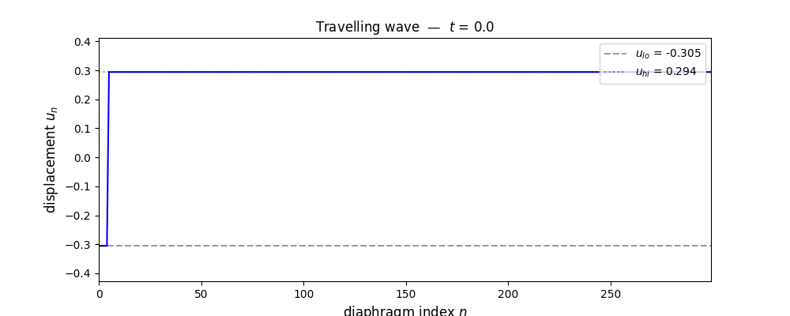
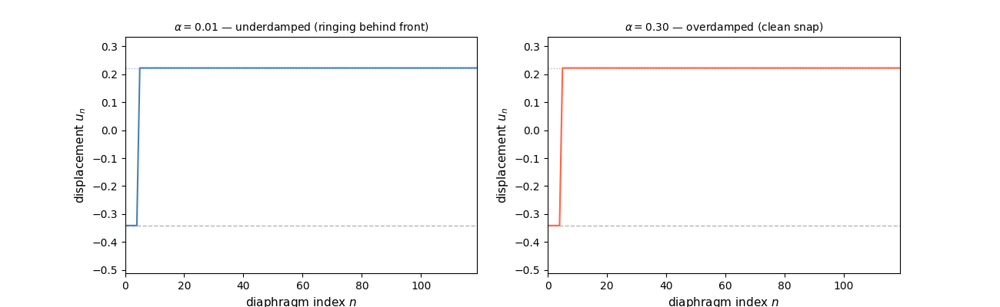
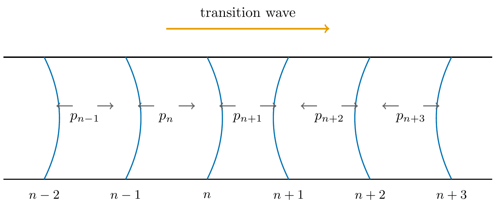

# 1D Bistable Diaphragm Metafluid


Transition waves in a chain of bistable diaphragms coupled by compressible gas pockets.

This is the code behind ***Transition Waves in a Fluid-Coupled Bistable Diaphragm Metafluid*** (S. Gambart, PX915 individual project, HetSys CDT, University of Warwick). Every figure and number in that report is produced here. The sections below follow the report's results, §3.1 to §3.4, so a claim in the paper can be traced to the notebook that produced it.

The reproducible-result protocol — the reference wave speed and the tolerance to check it against — is submitted separately.

## The wave

A transition wave crossing 120 diaphragms. Each one snaps from its high-energy state to its low-energy state as the front arrives, and the energy released drives the front onward ($A=1$, $\delta=0.009$, $\alpha=0.05$, $\Delta t=10^{-4}$):



Damping decides what the wake looks like. Underdamped ($\alpha=0.01$, left) the diaphragms ring down after snapping and leave an oscillatory tail; overdamped ($\alpha=0.30$, right) each snap is clean and the front is sharp:



These are the two things a space-time diagram cannot show, which is why the report points here for them.

## Getting started

```bash
git clone https://github.com/Stephang217/1D_Diaghphragms_Fluid_Model
cd 1D_Diaghphragms_Fluid_Model
pip install -r requirements.txt
jupyter notebook dimensionless_model.ipynb
```

Every expensive sweep is cached as a CSV in `results/`, so the notebooks run top to bottom in minutes rather than recomputing. Set `FORCE_RERUN = True` in a notebook's setup cell to recompute instead. Reproducing the headline number needs `numpy` alone.

## The model



Bistable diaphragms (blue) sit at regular intervals along a fluid-filled pipe, each sealing a pocket of gas from its neighbour. The gas obeys Boyle's law, so when a diaphragm snaps it compresses the pocket ahead and can trigger the next one. Each diaphragm has a cubic restoring force, giving a double-well potential whose slight asymmetry is the energy the wave spends.

Eight physical parameters reduce to four dimensionless groups,

$$\eta = \frac{A p_0}{k a^3}, \qquad \theta = \frac{A a}{V_0}, \qquad \Pi = \frac{\delta}{a^3}, \qquad \Omega = \frac{\alpha}{a\sqrt{mk}},$$

and the gas force factorises exactly into a linear spring of stiffness $\kappa = \eta\theta$ times a Boyle correction. That split is what separates the spring-like part of the coupling from the part only a fluid can produce. ([TikZ source for the schematic](figures/src/schematic.tex).)

## Key results

**§3.1 — The four-group reduction is exact.** Two systems built with deliberately unlike dimensional parameters but matched groups, integrated alongside the dimensionless equation itself, agree to $1.0\times10^{-14}$ in the maximum norm over the whole run. That is integrator round-off at double precision, not a modelling residual.

**§3.2 — Front width is the gate.** The coupling reaches the wave only through $\kappa = \eta\theta$, which sets the front width $w = \sqrt{2\kappa}$ in lattice spacings. The energy-balance speed formula is accurate to $0.2\%$ wherever the front spans three sites or more and to $1.2\%$ down to two, degrading quickly below that as the lattice stops resolving the profile the formula integrates over. Narrow the front further and the wave stops outright: between $\kappa = 0.30$ and $0.34$, at widths of $0.78$ and $0.83$ spacings, Peierls–Nabarro pinning arrests it. Weakening the *drive* never does this at canonical coupling — the barrier is what moves, not the supply.

**§3.3 — Compression and rarefaction differ, and that is the fluid's signature.** A wave that squeezes the pockets runs faster than its mirror image that stretches them: $2.7\%$ at $\theta = 0.1$, $11.3\%$ at $\theta = 0.4$, $215\%$ at $\theta = 4$, with no plateau. Under spring coupling the gap is identically zero. It ends where the stretching wave pins, between $\theta = 7.5$ and $7.75$, with its front $0.80$ spacings across — the same width the coupling sweep arrests at. The fingerprint and the pinning threshold are one mechanism seen along two axes.

**§3.4 — How well the speed is known.** At the protocol point, $v = 0.2206 \pm 0.0001$ (numerical) $\pm 0.0219$ (parametric). The parametric band is a $9.9\%$ spread from $\pm10\%$ manufacturing tolerances on $\delta$, $A$ and $\alpha$, which lands close to the input tolerance because the closed form reduces to $v \propto \delta A/\alpha$, each to the first power. Dividing that dependence out collapses the spread to $0.45\%$. Per-diaphragm disorder is a separate and much smaller effect: it self-averages over the many sites a front spans, contributing about an eleventh of what the same tolerance does when it displaces the whole chain.

<details>
<summary>Wave-speed sweep — 6 of 45 combinations</summary>

| $A$ | $\delta$ | $\alpha$ | $v_{sim}$ | $v_{pred}$ | ratio |
|---|---|---|---|---|---|
| 1.0 | 0.001 | 0.10 | 0.2208 | 0.2203 | **1.00** |
| 1.0 | 0.001 | 0.05 | 0.4085 | 0.4135 | **1.01** |
| 1.0 | 0.003 | 0.10 | 0.5533 | 0.5543 | **1.00** |
| 1.0 | 0.009 | 0.05 | 0.7972 | 1.1478 | 1.44 |
| 0.5 | 0.009 | 0.02 | 0.4655 | 1.2096 | 2.60 |
| 2.0 | 0.009 | 0.02 | 0.3052 | 9.0168 | 29.55 |

In groups these six span $\Omega = 0.067$ to $0.333$ and $\Pi = 0.037$ to $0.333$. The rows where the ratio holds are the well-damped ones; the three that degrade are at $\Omega \le 0.167$ and strong drive, which is the low-damping corner §3.2 identifies. Front width is not what fails here — the worst row has the widest front of the six. Full results in [`results/wave_speed_sweep.csv`](results/wave_speed_sweep.csv).

</details>

## What's here

| notebook | what it holds |
|---|---|
| [`dimensionless_model.ipynb`](dimensionless_model.ipynb) | the four-group results of §3.1–§3.3: verification, the validity map, pinning, and the squeeze/stretch gap |
| [`uq_reproducible_result.ipynb`](uq_reproducible_result.ipynb) | §3.4: the protocol point, the tolerance ensemble and the per-diaphragm disorder study |
| [`diaphragm_metafluid.ipynb`](diaphragm_metafluid.ipynb) | the dimensional groundwork the above is built on — the raw $A$, $\delta$, $\alpha$ sweeps, the energy audit and the ringing physics. Produces no report figure. |

The simulator lives in `src/` and is shared by the notebooks and by the sweep scripts in `scripts/`, so every number comes from one implementation. The full derivation of the discrete model is in [`docs/`](docs/Derivation_of_discrete_model_to_continuum_wave_speed.pdf).

```
.
├── dimensionless_model.ipynb      # four groups: validity map, pinning, gas-vs-spring
├── uq_reproducible_result.ipynb   # reproducible result, tolerance ensemble, disorder
├── diaphragm_metafluid.ipynb      # dimensional groundwork
├── src/                           # shared simulator, gradient stencil, plotting style
├── scripts/                       # ensemble and sweep generators
├── figures/                       # plots, animations, and the sources for those no notebook makes
├── results/                       # cached sweep outputs (CSV, with metadata headers)
├── paper/                         # report appendices and bibliography
└── docs/                          # analytical derivations
```

## Superseded results

Earlier versions of this README reported that post-snap ringing accounts for ~34% of dissipation and is why the formula overpredicts at low damping, and that volume collapse above $A \approx 1.8$ stalls the wave. Better-sized tests overturned both. In steady state the ringing wake carries only a few percent of the dissipation, and the low-damping overprediction survives long after the ringing has fully decayed, so it is a genuine steady-state effect — neglected front inertia and lattice radiation — rather than a measurement artefact. The $A$ limit did not reproduce once the damping and initial conditions were corrected.

## References

1. N. Nadkarni, A. F. Arrieta, C. Chong, D. M. Kochmann, C. Daraio. *Unidirectional transition waves in bistable lattices.* Physical Review Letters, 116(24):244501, 2016.
2. M. Hwang, A. F. Arrieta. *Input-independent energy harvesting in bistable lattices from transition waves.* Scientific Reports, 8:3630, 2018.
3. O. Peretz, E. Ben Abu, A. Zigelman, S. Givli, A. D. Gat. *Multistable metafluid based energy harvesting and storage.* Advanced Materials, 35:2301483, 2023.
4. J. R. Raney, N. Nadkarni, C. Daraio, D. M. Kochmann, J. A. Lewis, K. Bertoldi. *Stable propagation of mechanical signals in soft media using stored elastic energy.* PNAS, 113(35):9722–9727, 2016.
5. G. Puglisi, L. Truskinovsky. *Mechanics of a discrete chain with bi-stable elements.* Journal of the Mechanics and Physics of Solids, 48(1):1–27, 2000.

## License

Released under the MIT License.
